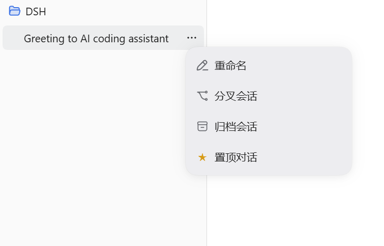
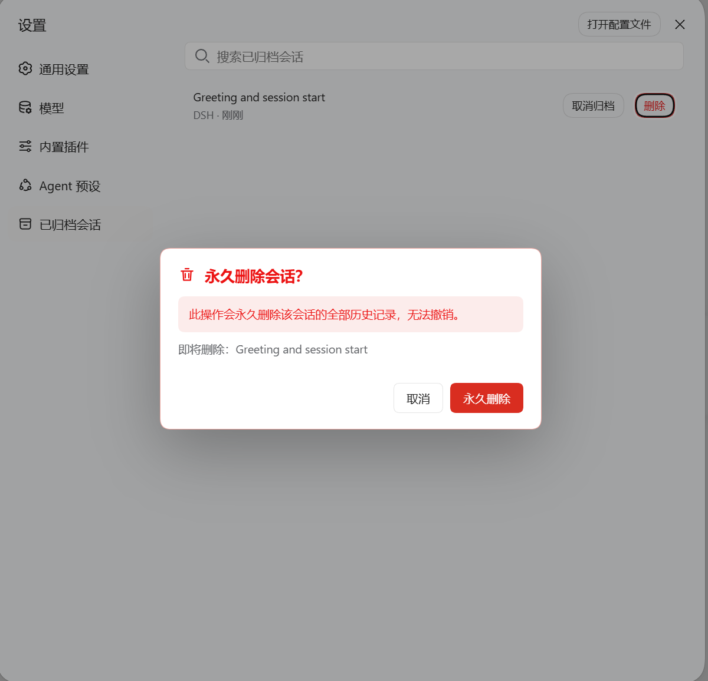

# dsh-session-organizer

[简体中文](README.zh-CN.md)

A compact, unofficial session-organizing plugin for DeepSeek Harness Web. It adds workspace-aware pinned sessions and a guarded permanent-delete action to the built-in Archived Sessions settings page.

> This is an independent community project and is not affiliated with or endorsed by DeepSeek.

## Screenshots

| Session actions | Guarded permanent deletion |
| --- | --- |
|  |  |

## Features

- Pin or unpin a session from its secondary row menu.
- Show pinned sessions above the workspace list in the same scroll container.
- Keep pins grouped by workspace and show one prominent, folder-marked workspace heading per group.
- Reposition an expanded row menu when the injected pin action would otherwise be clipped by the viewport.
- Drag to reorder pins within the same workspace.
- Add a red Delete action after Unarchive in the built-in archived-session list.
- Require a red, explicit confirmation dialog before permanent deletion.

## Safety

Deletion is accepted only for an archived session whose persistence artifact resolves inside the Harness-managed sessions root. If that session is selected in the main view, the client starts a blank session in the same workspace first. If the target Agent is running, only that Agent is cancelled and allowed to become idle.

Harness `0.1.6-alpha.2` does not yet expose a public close-one-Host-session API. For the default JSONL persistence backend, the plugin flushes the exact idle Session and feature-detects its exact active writer so that only that handle is closed; Harness is not restarted and other Sessions are not stopped. The directory is then quarantined with an atomic rename before workspace metadata is updated. A foreign lifecycle or storage lock that cannot be released safely is refused, and failures attempt to roll back both the directory and workspace membership.

If a live deletion fails after its writer was closed, the plugin restores the quarantined data and reopens that exact writer before returning the error, so the still-live Session remains durable.

A successfully deleted Session that remains temporarily resident in the current Host process is tombstoned and continuously filtered from the client catalog, so it cannot reappear under Ungrouped. The plugin also recovers leftovers from earlier versions when a live unowned Session no longer has any persistence record.

Permanent deletion cannot be undone. Back up important sessions.

## Requirements

- DeepSeek Harness `0.1.6-alpha.2`
- Node.js 24+

## Install

From GitHub:

```powershell
dsh plugin --profile web add github:martin2026US-lab/dsh-session-organizer
```

Local source:

```powershell
dsh plugin --profile web add <absolute-path-to-this-project>
```

From npm, after a future npm release:

```powershell
dsh plugin --profile web add dsh-session-organizer
```

Restart the Web profile after installation. To remove the plugin:

```powershell
dsh plugin --profile web remove dsh-session-organizer
```

No user name, drive letter, or custom Harness directory is embedded in the plugin. Harness resolves its own home and session roots. Pin state is stored at `<DSH_HOME>/plugins/dsh-session-organizer/pins.json`.

## Verify

```powershell
npm run verify
```

Before publishing, also exercise pin, unpin, same-workspace drag reorder, and opening/cancelling the delete dialog in the real Web UI. Do not confirm deletion in automated UI tests unless a disposable fixture session was created for that purpose.

## Compatibility note

Harness `0.1.6-alpha.2` does not expose a session-row menu extension slot or a slot above the workspace list. State, navigation, and persistence use Harness services; a lifecycle-managed DOM adapter supplies only those two visual insertion points. `engines.dsh` is intentionally pinned to the tested prerelease.

## Contributing

Bug reports and focused pull requests are welcome. Include the exact Harness version, browser, operating system, reproduction steps, and relevant logs. Do not attach private session logs without removing credentials and personal content.

See [SECURITY.md](SECURITY.md) for security-sensitive reports and [CHANGELOG.md](CHANGELOG.md) for release history.

MIT licensed.
